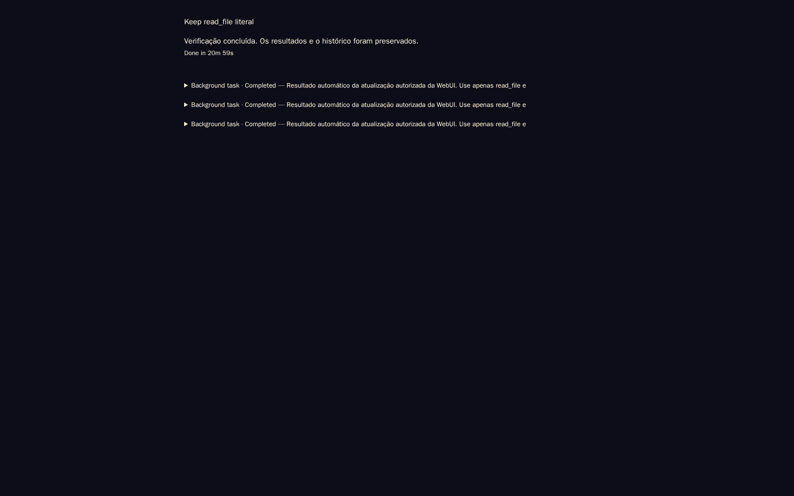
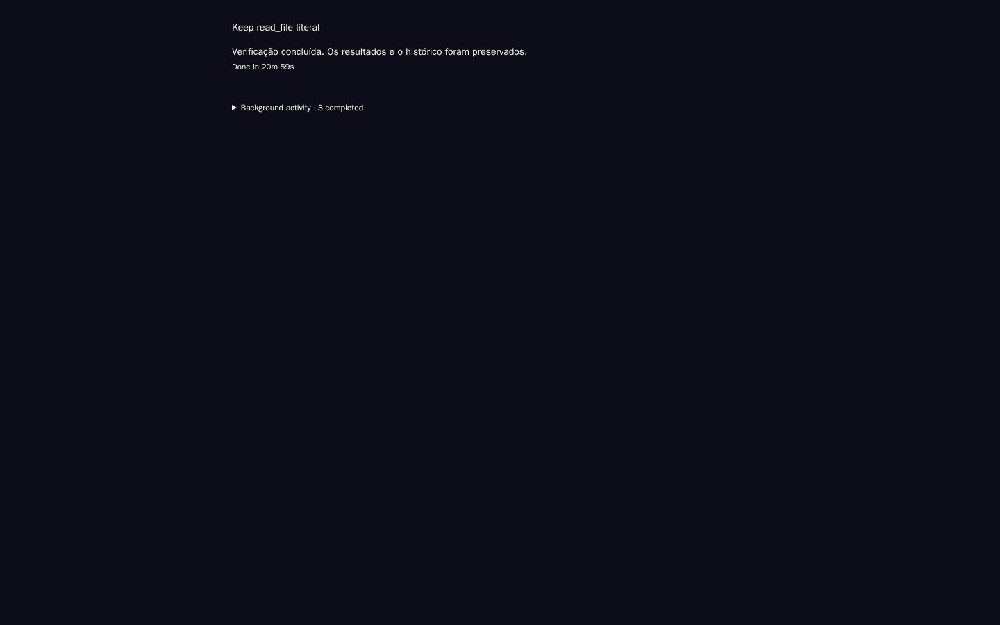
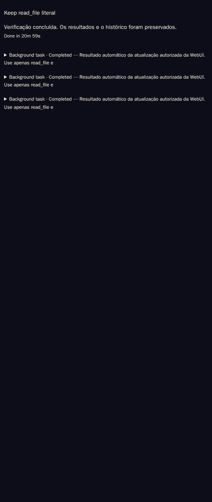
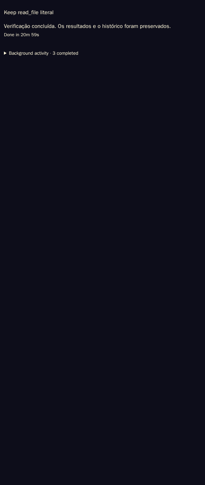

# Chat reliability integration verification

This integration brings the product changes into the public fork without
server-specific model defaults, autofill policy, blob/compression admission
limits, operational scripts, credentials, or deployment artifacts.

## Locally repeated on the public integration tree

- Repository `scripts/test.sh`: **335 passed** across 34 selected files, covering
  turn-owned delegation, source preservation, previews/full content, sidebar
  covering indexes, lineage, read-only reads, gateway reconciliation and locales.
- Canonical English fallback verifies string copy plus the counted history function
  in every locale, including 0/1/3, absent/null/localized overrides and mutation
  guards. Locale parity still rejects unrelated missing or mistyped translations.
- `scripts/ruff_lint.py --diff origin/master`: no new violations.
- `tests/browser_background_tasks.py`: successful completed-history behavior,
  0/1/many records, keyboard/full output, active/failure visibility, repeated
  polling, navigation and lifecycle cleanup at 1440, 522 and 390 px widths.
- `BG_BASELINE=1 python tests/browser_background_tasks.py`: expected assertion
  failure on public baseline `c052aa9` because successful tasks remain individual
  footer rows. The same test passes on the integrated renderer.
- `tests/browser_background_activity.py`: isolated real-server/browser checks
  at 1440x900, 522x1232 and 390x844. Covers notification-only groups, principal
  answers outside groups, disclosure identity/focus, virtualized geometry,
  A-B-A hydration races, readable previews, explicit full content, reload,
  lossless Markdown/JSON export and unchanged canonical transcripts. No page
  errors or horizontal overflow; disposable import fixtures are removed.

These browser fixtures are synthetic and provider-free. They do not certify
fresh model inference or production latency. Runtime acceptance for a deployment
must additionally follow `architecture/turn-owned-delegation.md` and
`sidebar-read-performance.md`. This repository integration does not redeploy or
restart any running service. The full remote CI matrix is reported separately
on the pull request; this is not a claim that every repository test ran locally.

## Synthetic before/after evidence

The component fixture uses the actual renderer, stylesheet and localization
code with controlled task data. It contains no live conversation or credentials.

### Desktop (1440x900)

Before:

After:

### Mobile (522x1232)

Before:

After:

